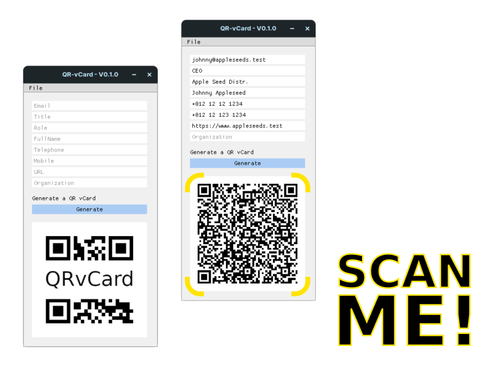
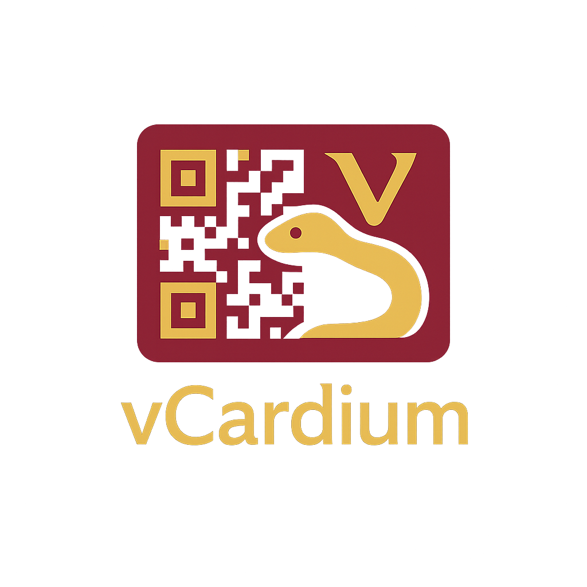

<p align="center">
  
</p>

<p align="center">
  
  
  
  
</p>

<p align="center">
  
</p>

<h1 align="center">
  
</h1>
<div align="center">

🚀 <b>vCardium</b> transforms how you share contacts.<br>
Generate secure, offline vCard QR codes for digital business cards—instantly and effortlessly.<br>
<b>Privacy-first</b> • <b>Cross-platform</b> • <b>No cloud, no tracking</b>

</div>
<p align="center">
  
</p>


## 📝 Overview

**vCardium** is a single-purpose, cross-platform desktop application for generating digital business cards in vCard QR format.  
Designed for professionals who value speed, privacy, and simplicity.

- Enter your contact details in an intuitive GUI
- Instantly create a QR code containing all vCard info
- Scanable by all modern mobile devices
- Perfect for business cards, resumes, artwork, and more

**Why vCardium?**  
Empower anyone to share contacts in seconds—without relying on third-party servers or sacrificing privacy.

## ✨ Features

- 🚀 **Instant QR Code generation for digital business cards**
- 🔒 **Privacy-first:** 100% offline, nothing sent to the cloud
- 💻 **Cross-platform:** Works on Windows, Mac, Linux
- 🎨 **Modern, easy-to-use GUI** (DearPyGui)
- 🖨️ **Export to PNG/JPG and .vcf files**
- 🔎 **Scan-ready:** Compatible with all smartphones
- 🆓 **Open Source:** MIT licensed and free for everyone

## 🔍 Comparison

| Feature           | vCardium      | Online Tools   |
|-------------------|:-------------:|:--------------:|
| Privacy           | ✅ 100%        | ❌            |
| Offline Support   | ✅            | ❌            |
| Custom Branding   | ✅            | ❌            |
| Open Source       | ✅            | ❌            |

## ⚡ Quick Start

1. **Install dependencies** (Python 3.10+, pipenv recommended):

```bash
pip install pipenv
pipenv sync
```
Run the application:
```
pipenv run python3 project.py
```
Alternatively:
```
pip install -r requirements.txt
python3 project.py
```

## 📇 vCard Format

All QR codes generated by vCardium are based on the open [vCard (VCF) 4.0 format](https://datatracker.ietf.org/doc/html/rfc6350):

**Example:**

```plaintext
BEGIN:VCARD
VERSION:4.0
KIND:individual
FN:John Doe
EMAIL:johndoe@example.com
TEL;TYPE=CELL:+1234567890
ORG:Example Inc.
TITLE:Developer
END:VCARD
```
Your generated QR code can be scanned, imported, or shared across all modern devices.

## 📁 Project Structure

```plaintext
.
├── images/             # App icons and screenshots
├── readme/             # README banners/images
├── LICENSE
├── Makefile
├── Pipfile(.lock)
├── requirements.txt
├── dev-requirements.txt
├── project.py          # Main application
├── test_project.py     # Tests
├── vCardium.code-workspace
└── README.md
```
## 🧑‍💻 Development & Testing

To set up a development environment and run tests:

```bash
pipenv install --dev
make dev         # for development
make tested      # to run unittests (uses pytest)
```
Or manually:
```
pipenv run pytest
```
---
## ❓ FAQ

**Q: Can I use vCardium without internet?**  
A: Yes, everything runs locally on your device.

**Q: Is my data stored or sent anywhere?**  
A: No, all processing is offline and nothing is uploaded.

**Q: What platforms are supported?**  
A: Windows, MacOS, and Linux.

## 🤝 Contributing

Pull requests and feature suggestions are welcome!  
See [CONTRIBUTING.md](CONTRIBUTING.md) for guidelines.

## 🛣️ Roadmap

- [ ] Export QR as SVG
- [ ] CLI interface
- [ ] Multi-language support
- [ ] Drag & drop import for contact files

## 🥚 Easter Egg

If you generate a QR code with no contact details, you'll unlock a special surprise...  
(Hint: Never gonna give you up 🎵)

## 🌟 Contact

For questions, collaboration, or feedback:  
[🗨️ Issues Page](https://github.com/PeakPy/vCardium/issues)  
[📧 EhsanAkbari.Dev@gmail.com](mailto:EhsanAkbari.Dev@gmail.com)


